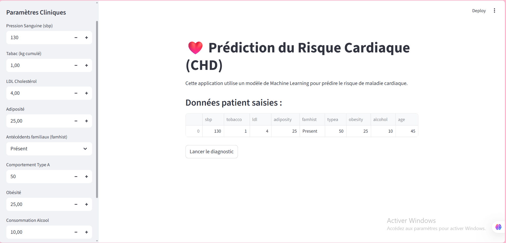
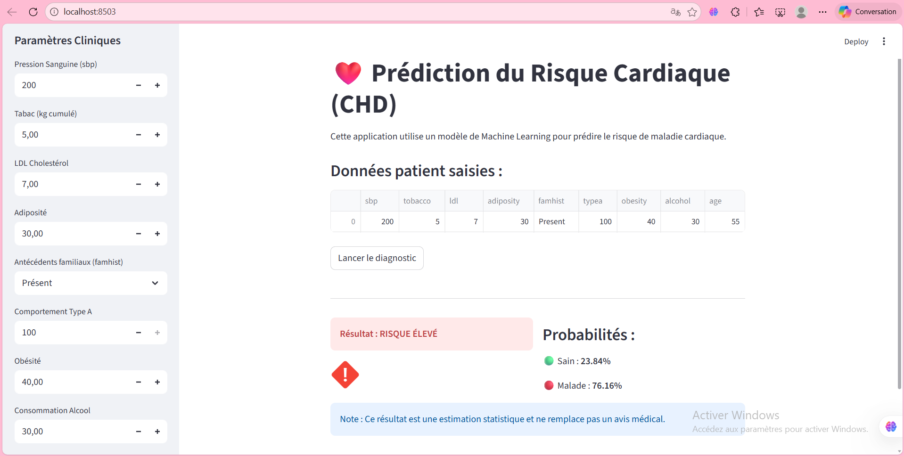

# ❤️ Analyse Prédictive du Risque de Maladie Cardiaque

[](https://heart-disease-predictionminiproject-lgkfmpqcpxnh3q9mqqxhgf.streamlit.app/)


> **Mini Projet de Machine Learning - Année Universitaire 2025-2026**

Ce projet vise à développer une chaîne de traitement complète (pipeline) pour prédire le risque de maladie coronarienne (CHD) à partir d'indicateurs cliniques et démographiques. Il inclut l'analyse exploratoire, le prétraitement avancé, la modélisation (avec ACP et SMOTE) et le déploiement d'une application Web.

---

## 🚀 Démo en Direct

L'application est déployée et accessible via Streamlit Cloud :
👉 **[Accéder à l'application de prédiction](https://heart-disease-predictionminiproject-lgkfmpqcpxnh3q9mqqxhgf.streamlit.app/)**

---

## 📂 Structure du Projet

Le dépôt contient les fichiers suivants :

- **`app.py`** : Code source de l'application Streamlit (interface utilisateur).
- **`heart_disease_modeling.py`** : Script complet d'entraînement (Exploration, Pipeline, ACP, Modélisation).
- **`Model.pkl`** : Le modèle final entraîné et sérialisé (Régression Logistique).
- **`CHD.csv`** : Jeu de données original.
- **`requirements.txt`** : Liste des dépendances Python.
- **`Rapport.pdf`** : Rapport détaillé du projet.
- **`*.png`** : Images et captures d'écran utilisées dans le rapport et ce Readme.

---

## ⚙️ Installation et Exécution Locale

Si vous souhaitez lancer le projet sur votre machine :

1. **Cloner le dépôt :**
   ```bash
   git clone [https://github.com/flamekk/heart-disease-prediction_mini_project.git](https://github.com/flamekk/heart-disease-prediction_mini_project.git)
   cd heart-disease-prediction_mini_project

```

2. **Installer les dépendances :**
Assurez-vous d'avoir Python installé, puis exécutez :
```bash
pip install -r requirements.txt

```


3. **Lancer l'application Streamlit :**
```bash
streamlit run app.py

```


4. **(Optionnel) Ré-entraîner le modèle :**
Si vous souhaitez régénérer le fichier `Model.pkl` et les graphiques d'analyse :
```bash
python heart_disease_modeling.py

```


---

## 📊 Méthodologie

### 1. Prétraitement (Pipeline)

* **Variables Numériques :** Imputation par la médiane + Standardisation (StandardScaler).
* **Variables Catégorielles (`famhist`) :** Imputation par le mode + Encodage One-Hot.

### 2. Réduction de Dimension

* Utilisation de l'**ACP (Analyse en Composantes Principales)**.
* **7 composantes** retenues pour conserver ~90% de la variance expliquée.

### 3. Modélisation et Comparaison

Nous avons comparé deux approches principales :

* **Régression Logistique** (avec et sans ACP).
* **KNN (K-Nearest Neighbors)** optimisé avec **SMOTE** pour gérer le déséquilibre des classes.

🏆 **Modèle retenu :** Régression Logistique sans ACP (Accuracy : ~71.24%), choisie pour sa robustesse, son interprétabilité et sa rapidité d'exécution.

---

## 🖥️ Aperçu de l'Application

L'application permet de saisir les paramètres du patient (âge, tabac, tension, etc.) et fournit un diagnostic en temps réel accompagné d'une probabilité.

| Interface de Saisie | Exemple : Risque Élevé |
| --- | --- |
|  |  |

---

## 👥 Auteurs

Projet réalisé par :

* **Hiba Zbari**
* **Aya Fadel**
* **Najoua Mouaddab**

---

*Ce projet a été réalisé dans un cadre académique.*

```
